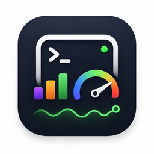
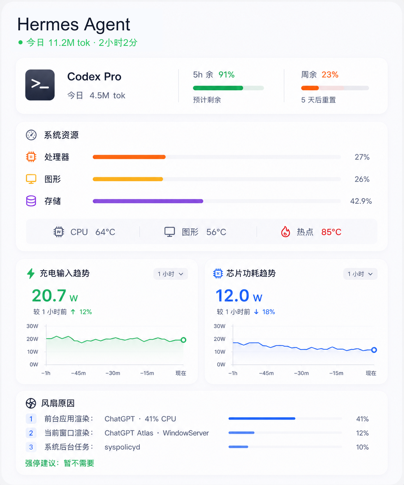
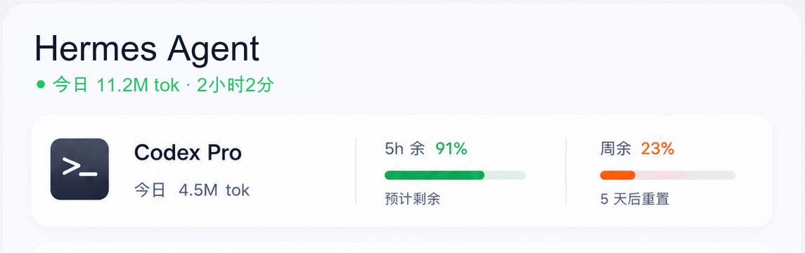
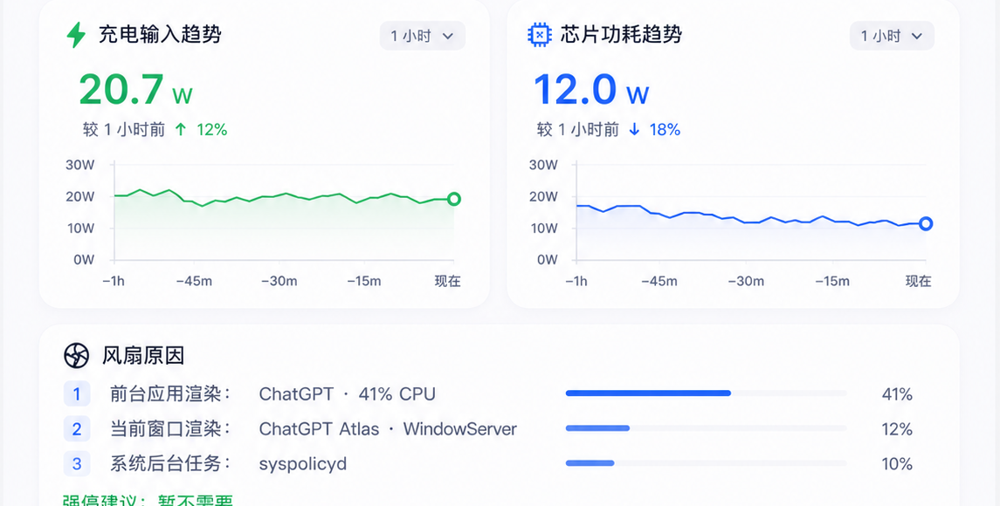

<div align="center">



# Nexus

**A native Apple Silicon system monitor for Hermes Agent workflows.**

CPU, GPU, storage, temperature, fan cause, charging input, chip power, network,
battery, country, and Codex quota — packed into a compact macOS menu-bar panel.

[](https://www.apple.com/macos/)
[](https://www.apple.com/mac/)
[](https://developer.apple.com/xcode/swiftui/)
[](LICENSE)

<br/>

<table>
  <tr>
    <td></td>
    <td></td>
    <td></td>
  </tr>
  <tr>
    <td align="center"><sub>Current dashboard</sub></td>
    <td align="center"><sub>Hermes + Codex usage</sub></td>
    <td align="center"><sub>Power + fan context</sub></td>
  </tr>
</table>

</div>

---

## Highlights

- **Hermes Agent usage**: today's token usage and active session duration.
- **Codex quota**: live 5-hour and weekly remaining quota from the local Codex auth session.
- **System resources**: CPU, GPU, storage, CPU temperature, GPU temperature, and hotspot temperature.
- **Power trends**: charging input trend and chip power trend with compact charts.
- **Fan context**: current fan speed, likely workload causes, and stop advice.
- **Network context**: current network speed and country display.
- **Native sensors**: reads macOS / Apple Silicon telemetry through SMC, IOReport, IOKit, and system APIs.

## Install

Download the latest DMG from [Releases](../../releases/latest), drag `Nexus.app` into Applications, then launch it once.

One-line installer:

```bash
curl -fsSL https://raw.githubusercontent.com/francoeur003/Nexus/main/install.sh | bash
```

Homebrew cask from this repo:

```bash
brew tap francoeur003/nexus https://github.com/francoeur003/Nexus
brew install --cask nexus
```

## Build

```bash
git clone https://github.com/francoeur003/Nexus.git
cd Nexus
open Nexus.xcodeproj
```

Select the `Nexus` scheme in Xcode and run. The source folder and scheme keep their original technical names for build stability; the shipped product is `Nexus.app`.

Build a release DMG:

```bash
./scripts/build-dmg.sh
```

## Data Sources

Nexus collects local-only telemetry using native macOS interfaces:

| Source | Used for |
| --- | --- |
| SMC | temperatures, fan RPM, battery and power keys |
| IOReport | CPU/GPU/DRAM/ANE power rails and frequencies |
| IOKit | battery and power adapter details |
| Mach host stats | CPU, memory, and process sampling |
| SystemConfiguration / network APIs | local network, country, and speed context |

## Privacy

Nexus is a local macOS utility. Hardware metrics stay on the machine. Codex quota is read from the local Codex auth session and queried against the ChatGPT backend API only for the signed-in account's usage metadata.

## License

MIT. This project is derived from MIT-licensed work and keeps the required copyright notice in [LICENSE](LICENSE).
